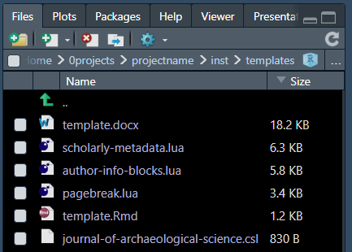

:::::::::::::::::::::::::::::::::::::: questions 

- Where can I add my functions?
- How do I need to document my functions?
- How do I facilitate the readability of my functions documentation?
- How can I increase the visibility of guidelines for support and contributions?

::::::::::::::::::::::::::::::::::::::::::::::::

::::::::::::::::::::::::::::::::::::: objectives

- Run your custom project functions using `{devtools}`
- Create a website for your custom functions using `{usethis}`

::::::::::::::::::::::::::::::::::::::::::::::::

## What about my functions?

We must write our custom functions as _Modular functions_ and save them in the `R/` folder. To load your project functions, as written in `line 20` of the `make.R` file, run:

```r
devtools::load_all(here::here())
```

You can follow a [standard documentation method](https://r-pkgs.org/man.html). The `{rcompendium}` template already contains a `fun-demo.R` for this. 


:::callout

Remember that _documented functions_ can facilitate further efforts to reuse them and create a specific R package!

:::


:::challenge

### How do I navigate my functions documentation?

Is there an easier way to navigate the documentation for my _modular functions_? Run the following code and get a surprise:

```r
usethis::use_pkgdown_github_pages()
```

:::

### Create website files

To improve the visibility of all these new files, we can create a website using [GitHub pages](https://pages.github.com/). To make this possible run:

```r
usethis::use_pkgdown_github_pages()
```

This function implements the GitHub setup needed to automatically publish your site to GitHub pages using the [`{pkgdown}` package](https://pkgdown.r-lib.org/).

This output is possible in two steps: 

- First, it prepares to _publish_ the pkgdown site from a new `gh-pages` branch. 
- Then, it configures a [GitHub Action](https://github.com/features/actions) to automatically _build_ the site and _deploy_ it via GitHub Pages.

Lastly, the `pkgdown` site's URL is added to the `pkgdown` configuration file, to the URL field of `DESCRIPTION`, and to the GitHub repo.

Commit and Push your changes.

:::callout

Remember that when using _GitHub Actions_, next to the `SHA/hash` will be the _status icon_ of the actions. 

- Yellow ball for "Job running", 
- Red cross for "Failed Run", and 
- Green check for "job done!".

:::

Please wait for it to get green and inspect the Reference tab on the navigation bar.

Now, let's compare the `fun-demo.R` file and the website format:


:::callout

### Why could we opt to have a website for our project?

To facilitate the navigation through 

- community files and 
- function documentation.

:::

:::intructor

If required, you can add vignettes for an `{rcompendium}` using: 

```r
rcompendium::add_vignette(filename = "vignette-01")
```

Vignettes look more suitable for package documentation than a project. But knowing that we have that alternative with the `{rcompendium}` template is helpful.

:::

## How do I write a manuscript for my project?

You can use handy functions from another research compendium package called `{rrtools}`.

To get a template of files required to fill a manuscript run:

```r
rrtools::use_analysis(location = "inst", data_in_git = FALSE)
```

This function will create a folder `inst/` with a new set of folders for data and figures. You can avoid using them and only use the `.qmd` as a template for your manuscript.


The `.qmd` files get formatted from several template files like references using `.bib` and citation style using `.csl`.



Using `rrtools::use_analysis()` with those arguments will not modify your `{rcompendium}` configuration. Other functions can change it. 

:::instructor

This manuscript will not be visible on a website unless moved to the `vignette/` folder. We have yet to test that behaviour.

:::

:::callout

Remember that if you have all your changes as commits with git, you can _revert_ any modification with the button __`Revert`__, located between the `Stage` and `Ignore` buttons.


:::

::::::::::::::::::::::::::::::::::::: keypoints 

- Run your custom project functions with `devtools::load_all()`
- Create a website for your custom functions with `usethis::use_pkgdown_github_pages()`
- Use a manuscript template with `rrtools::use_analysis(location = "inst", data_in_git = FALSE)`

::::::::::::::::::::::::::::::::::::::::::::::::

