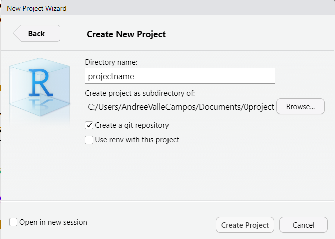
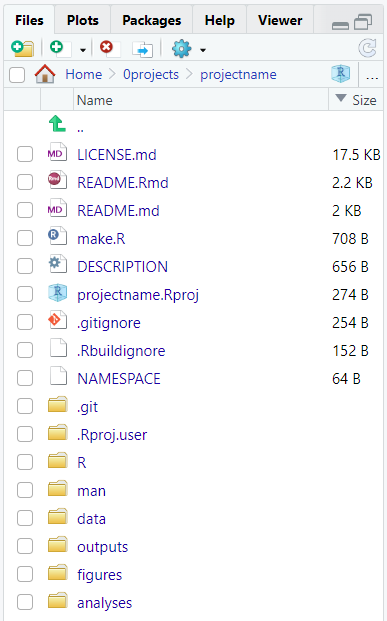
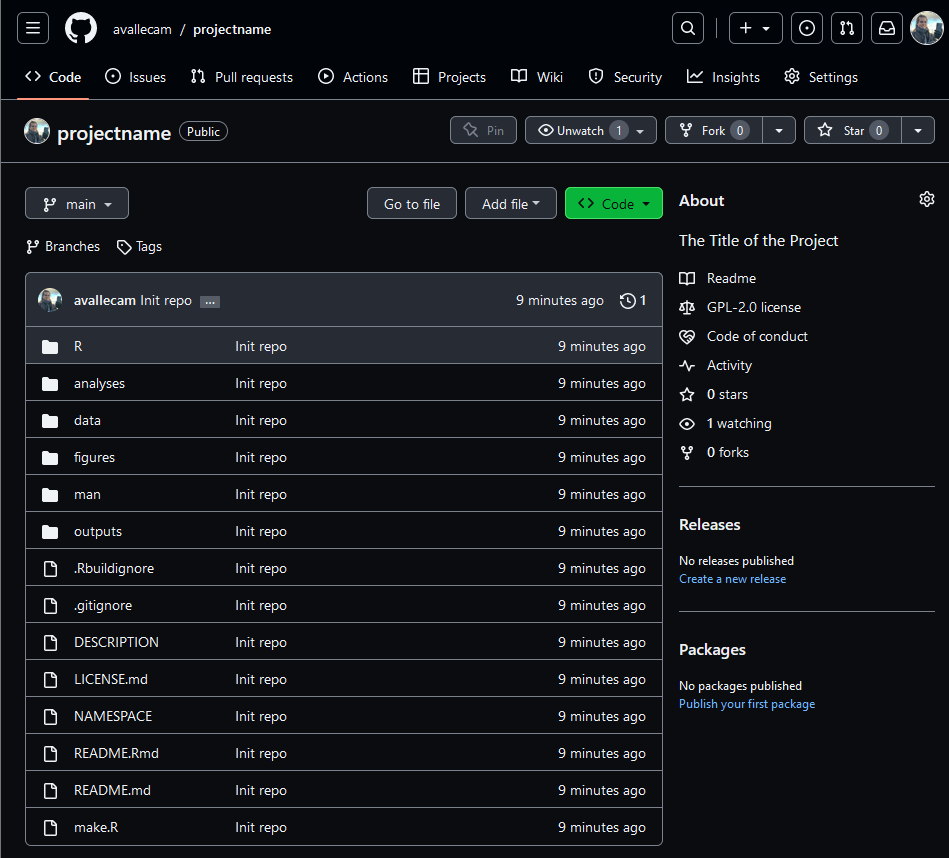
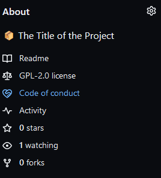
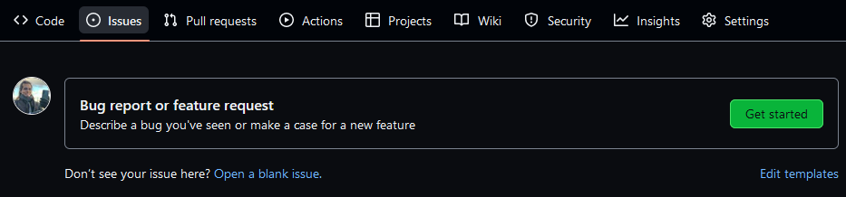

:::::::::::::::::::::::::::::::::::::: questions 

- How do you create a research compendium for an R project?
- How to facilitate users and collaborators to participate in my project?
- What features are related with sustainable software?

::::::::::::::::::::::::::::::::::::::::::::::::

::::::::::::::::::::::::::::::::::::: objectives

- Adapt a research compendium template with files and folders organized in a logical structure with `{rcompendium}`.
- Add community files for users to seek support and contribute with `{usethis}`
- Identify your project features related with sustainable software.

::::::::::::::::::::::::::::::::::::::::::::::::

## What is a research compendium?

A research compendium is a collection of all digital parts of a research project including data, code, and texts (protocols, reports, questionnaires, metadata). The collection is created in such a way that reproducing all results is straightforward ([ref](https://the-turing-way.netlify.app/reproducible-research/compendia#summary))

Using templates facilitates having all the required files from the beginning of your project.

We understand that creativity can be “messy”. In the present, you will be able to handle it but your collaborators (and the future you) may have problems understanding it. Reproducibility is as much about the humans that interact with the code as the machines that need to run it ([Ref](https://eliocamp.github.io/reproducibility-with-r/materials/day1/02-projects/)).

<!-- figure from this to that -->

## Let's code

### Create an Rstudio Project

Go to `Project`, which is in the top right corner of Rstudio and select `New Project...`. Follow this steps:

- Select `New directory`, 
- Select `New project`, and 
- Check the `[x] Create a git repository` option

:::callout

#### Stop! Find a name!

Don't use `projectname` as your R project name!

Create a new one thinking on your current research project.

:::

Your `projectname` must follow some rules for everything to work, it must:

- contain only ASCII letters, numbers, and `.` (it can not have a `-`)
- have at least two characters
- start with a letter (not a number)
- not end with `.`

{alt='New Project Wizard panel with Directory name and the Create a git repository box checked'}


### Create research compendium

To create a new research compendium run:

```r
rcompendium::new_compendium()
```

This will create new files and folders as a template. You can rearrange the folder elements by size to identify its components.



We are going to explore the content of each new element during the day.

This will also create the GitHub repository for your project. This step will open a new tab in your browser.



### Add community files

We are going to add more files into the default template. For this we are going to use a package with helper functions called [`{usethis}`](https://usethis.r-lib.org/).

To add community files run:

```r
usethis::use_tidy_github()
```

`usethis::use_tidy_github()` is a convenience [wrapper function](https://stackoverflow.com/q/44783295/6702544) that adds four template files in a new folder called `.github/`: 

- `SUPPORT.md` with resources to seek support.
- `CONTRIBUTING.md` with contributing guidelines.
- `issue_template.md` with steps on how to report issues.
- `CODE_OF_CONDUCT.md` with guidelines to foster an environment of inclusiveness, and to explicitly discourage inappropriate behavior.

These four files follow the tidyverse standards. You can edit them [writing with `Markdown`](https://rstudio.github.io/cheatsheets/html/rmarkdown.html#write-with-markdown) to fit your specific project content purposes.

:::prereq

Now `commit` and `push` your changes using `git`.

#### Git reminders

- We use [`git commit`](https://www.atlassian.com/git/tutorials/saving-changes/git-commit) captures a snapshot of the project's currently staged changes. We use `git add` to 'stage' changes that will be stored in a commit.

- We use [`git push`](https://www.atlassian.com/git/tutorials/syncing/git-push) to upload `local` repository content to a `remote` repository.

<!-- add a diagram for this -->

- You can use [Git with Rstudio](https://rviews.rstudio.com/2020/04/23/10-commands-to-get-started-with-git/) to performs these tasks.

:::

:::::::::::::::::::::::::::::::::::::::::::::::::::::::::::::::::::: instructor

#### Git with Rstudio reminder

- From the “Review changes” pane:
    + Go to the “History” tab in the top left.
    + Show that each commit has an ID under the SHA/hash column
    + Use 

- Go to GitHub:
    + Identify where this ID called SHA/hash is located.
    + When using GitHub Actions, next to the SHA/hash will be the status icon of the actions. Yellow ball for "Job running", Red cross for "Failed Run", and Green check for "job done!".

::::::::::::::::::::::::::::::::::::::::::::::::::::::::::::::::::::::::::::::::

### Where are community files visible?

These files are automatically recognized by GitHub and added as hyperlinks in specific places. 

1. Go to the __About__ section, in the right upper corner side of your repository, to read the `Code of conduct`:



2. Go to the __Issues__ tab on the navigation bar on the top of your repository on GitHub. There you will find a link to the `issue templates` you added.



3. Press the `"Get started"` button on the right to write on top of the template. In the lower right corner you will find the __Contributing__ and __Support__ files are accessible under the _Helpful resources_ subtitle.


These community files are also known as [community health files](https://github.blog/changelog/2019-02-21-organization-wide-community-health-files/)

:::discussion

- Do you find the links to the Community files visible enough on GitHub?

- Have you ever found them in a different place in the past?

:::


## Sustainable software features

A software is sustainable when its easier to __maintain__ and __extend__ rather than __replace__. This _easiness_ depends on the: 

- _Quality_ of the software, 
- _Skills_ of the potential maintainers, and 
- _How much_ the community of user is willing to invest to keep the software up to date.

Features like a __Compendium template__ and __Version control__ increase the quality of the software. A compendium follows a logical and familiar structure. A version control software registers the history of the project, how decisions were made, and how code was written by one or multiple contributors. Additionally, __Community files__ take into account any gaps in the community of users to facilitate their participation, and how to interact with maintainers.

:::testimonial

_Is a data analysis could also be considered as a piece of software?_ 

Nick Huber from the blog Towards Data Science, concludes that [data analysis best practices/tools are starting to strongly resemble practices/tools from software engineering](https://towardsdatascience.com/data-analysis-is-a-form-of-software-engineering-876232bd3ebc)

The repository of this lesson, also looks like a derivative of a research compendium, which also looks like a piece of software like an R package.

:::

::::::::::::::::::::::::::::::::::::: keypoints 

- Use `{rcompendium}` templates to reuse all the files and folders that a research project needs. 
- Use `{usethis}` to add complementary community files to a research project.
- Version control, Research compendium, and community files are features related to Sustainable software. 

::::::::::::::::::::::::::::::::::::::::::::::::

