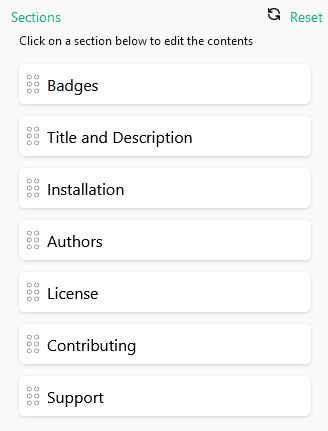
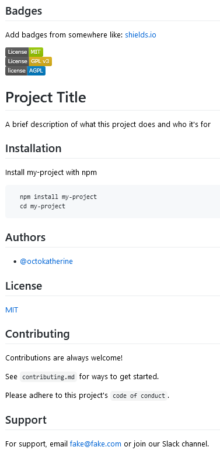
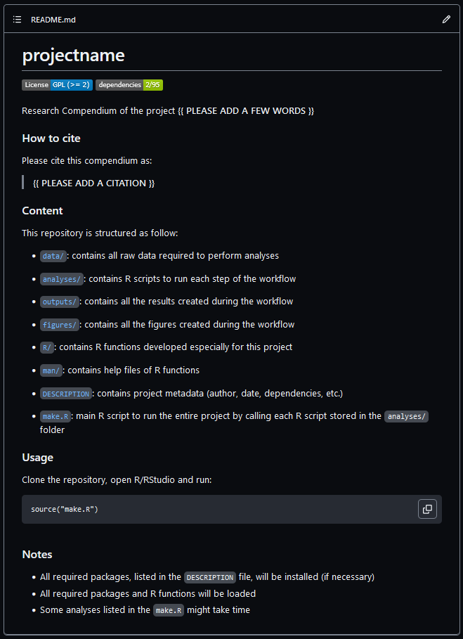

:::::::::::::::::::::::::::::::::::::: questions 

- Where can I give proper installation instructions?
- What licenses can I add for text, figures, and data?
- How do I generate a citation for my project?
- How can I increase the visibility of community guidelines?

::::::::::::::::::::::::::::::::::::::::::::::::

::::::::::::::::::::::::::::::::::::: objectives

- Recognise good practices for `README` files.
- Complement the `{rcompendium}` `README` template.
- Identify your project features related to Open science.

::::::::::::::::::::::::::::::::::::::::::::::::

## README files

`README` files can include a whole range of information from an _overview_ of the project, _installation_ instructions and _licensing_ details to information on how to contribute to the code and cite the software. With modern text markup and formatting through `Markdown`, `README` files can also be rendered in a much more _accessible_ and _appealing_ manner than traditional plain-text `README` files. ([Cohen and Crouch, 2023](https://www.imperial.ac.uk/computational-methods/rse/events/byte-sized-rse/))

### Good practices

There is no standard for `README` files, but we can use some widely used approaches. Here we list some `README` good practices collected by [Cohen and Crouch, 2023](https://www.imperial.ac.uk/computational-methods/rse/events/byte-sized-rse/):

- Consider a formatting, layout, or _structure_.
- Ensure _clear and concise_ descriptions.
- Avoid overloading the `README` with content that could be hosted elsewhere.
- Consider including a table of contents if you have many sections.
- _Know your audience_ - Is your `README` aimed at other developers or end-users of your software/code?

### Structure

Using an [online editor called readme.so](https://readme.so/), we selected some typical sections frequently found in R packages:



This selection generates this `README` file preview template:



We can find room for improvement if we compare this [readme.so](https://readme.so/) template with the `README` file from the `{rcompendium}` template.



In this episode, we will complement this template with some key sections. 

:::callout

We invite you to edit your `README` as you prefer! You can also use this simple [readme.so editor to generate more section templates](https://readme.so/) than the ones we will cover here.

:::

## Let's code

First, let's `Knit` the `README.Rmd`.

We must remember that our `README.md` is generated from the `README.Rmd` file. So we need to edit that file and `Knit` it after any update. This step is not done automatically for this template.

:::instructor

The `{usethis}` package provides control of flow functionality to commit the `README.md` only when synchronised with `README.Rmd`. We have yet to test that behaviour.

:::

### Installation

The `Usage` section includes the installation steps of:

- Clone a repository, and
- Use R/Rstudio.

We can assess our [target audience](https://third-bit.com/py-rse/documentation.html#documentation-audience) and adapt this content to our projects. 

Let's assume that the following personas are examples of the types of people that are your target audience:

- [Patricia](https://epiverse-trace.github.io/personas/patricia-discoverer.html) is a PhD student. She uses R to analyse infectious disease data and wants it to be reproducible. She is unfamiliar with GitHub and the terminal window.

- [Lucia](https://epiverse-trace.github.io/personas/lucia-outbreaks.html) is a Field epidemiologist. She uses R to clean data and create plots for outbreak response. She wants to communicate her doubts and ideas with package maintainers. She does not track the versions of her code with Git.

If we want to add external guides to facilitate the `git clone` step, we can complement our installation steps with external resources.

Copy, edit as you prefer, and paste it to your `README` file:

```
### Usage

First, clone this repository. You can follow [steps on creating a new Rstudio Project from a GitHub repository](https://www.epirhandbook.com/en/version-control-and-collaboration-with-git-and-github.html?q=clone#clone-from-a-github-repository). 

Then, run:
```

:::checklist

#### Checkpoint

`Knit` the `README.Rmd` file.

:::

:::callout

`Notes` are not part of the structure but information about the `Usage` step. We can add one more `#` to its heading.

:::

### Citation

We can take advantage of the `DESCRIPTION` file to generate a `CITATION` file.

First, open the `DESCRIPTION` file. 

Note that in the 5th line, the `Authors@R` section is already filled with your details. You set this up when running the Configuration steps with `rcompendium::set_credentials()`.

Second, write a `Title` for the Project in the 3rd line. The [`Title` should be written](https://r-pkgs.org/man.html#title-description-details) in sentence case, not ending in a full stop.


:::callout

[`CITATION.cff` is file format](https://ropensci.org/blog/2021/11/23/cffr/) that facilitates software citation in ecosystems like GitHub, Zenodo and Zotero.

:::

Third, to generate a CITATION.cff file from the DESCRIPTION file, we can install the `{cffr}` package:

```r
install.packages("cffr")
```

Fourth, create a `.cff` file:

```r
cffr::cff_write(dependencies = FALSE)
```

Commit and Push your changes. Identify that GitHub has built-in support for this citation.


:::challenge

#### How can I paste the CITATION in the README file?

:::solution

First, open the `CITATION.cff` file:

```r
usethis::edit_file(path = "CITATION.cff")
```

Our default `CITATION.cff` does not record the `year` of creation. To solve it, we can add this extra line at the end:

```
date-released: '2023-04-23'
```

Second, to read the `CITATION.cff` in the `README.Rmd`, as in
[this other tutorial README file](https://github.com/epiverse-trace/tutorials-early/blob/431ac47e0e58fcdfeecf6f90c559022a2be12c3e/README.Rmd#L70-L83):

1. Paste this template text in the `README.Rmd` at the Citation section

```
See [CITATION.cff](CITATION.cff) for citation information,
including a list of authors.
([Read more about the Citation File Format and how to use it](https://citation-file-format.github.io/).)

To cite these tutorials in publications use:
```

2. Add this chunk using following chunk options `eval=TRUE, echo=FALSE, comment=""`:

```r
cffr::as_bibentry(x = "CITATION.cff")
```

3. To include a BibTeX entry for LaTeX users, paste this chunk with options `eval=TRUE, echo=FALSE, comment=""`:

```r
utils::toBibtex(cffr::as_bibentry(x = "CITATION.cff"))
```

Lastly, `Knit` the `README.Rmd` file.

:::

:::

### Licenses

Our project has a [GPLv2](https://www.gnu.org/licenses/old-licenses/gpl-2.0.html) license registered in the `LICENSE.md` file and in the `DESCRIPTION` file as a [GPL (>=2)](https://choosealicense.com/licenses/gpl-3.0/).

We adapted text generated by the [`{rrtools}` package](https://github.com/benmarwick/rrtools/) template. 

Copy, edit as you prefer, and paste it to your `README` file:

```
### Licenses

**Text and figures :**  [CC-BY-4.0](http://creativecommons.org/licenses/by/4.0/)

**Code :** See the [DESCRIPTION](DESCRIPTION) file

**Data :** [CC-0](http://creativecommons.org/publicdomain/zero/1.0/) attribution requested in reuse
```

:::checklist

#### Checkpoint

`Knit` the `README.Rmd` file.

:::

### Contributing

We adapted this format from the template generated from [readme.so](https://readme.so/). We added hyperlinks to redirect to the Community files in the `.github/` folder.

Copy, edit as you prefer, and paste it to your `README` file:

```
### Contributing

Contributions are always welcome!

See our [Contributing guide](/.github/CONTRIBUTING.md) for ways to get started.

Please adhere to this project's [Code of Conduct](/.github/CODE_OF_CONDUCT.md).

### Support

Please see our [Getting help guide](/.github/SUPPORT.md) for support.
```

:::checklist

#### Checkpoint

`Knit` the `README.Rmd` file.

:::

:::instructor

Contributing guides and Function documentation are also visible in a website format. Please look at the Appendix episode to learn how to do it.

:::

### Markdown

In Markdown, the `Header 2` generates an underline that can help isolate sections of our chosen structure.


Remove one `#` from all the main headers. This edit generates a final `README` file that looks like this:


:::discussion

Consider your research project: 

- Would you add or remove any section from the `README` template above? Why?

Explore the [online editor called readme.so](https://readme.so/) to identify more sections that could suit your research project.

:::

:::testimonial

- We recommend you to [listen to the Code for Thought podcast](https://codeforthought.buzzsprout.com/1326658/12979597-en-bytesized-rse-the-readme-with-julian-lenz) episode on the `README` file. They also have a few links that you might find helpful.

- For Badges, we recommend reading a Blog post on [Communicating development stages of open-source software](https://epiverse-trace.github.io/posts/comm-software-devel/) at the Epiverse-TRACE website.

:::

:::checklist


:::


## Open science features

We define Open science as making software, data inputs and outputs _freely available_ by publishing all of them with open licences to facilitate project reuse.

A vital feature of this practice is the __Licenses__. Explicit licenses that include the _software_ and the specific license for _text and figures_ and _data_, in particular, are also relevant.

::::::::::::::::::::::::::::::::::::: keypoints 

- Complement the `README` template with Installation steps, Citations, Licenses and Contributing guides.
- Use different types of licenses of text and figures, software code, and data.
- _Licenses_ is a feature related to Open Science. 

::::::::::::::::::::::::::::::::::::::::::::::::

