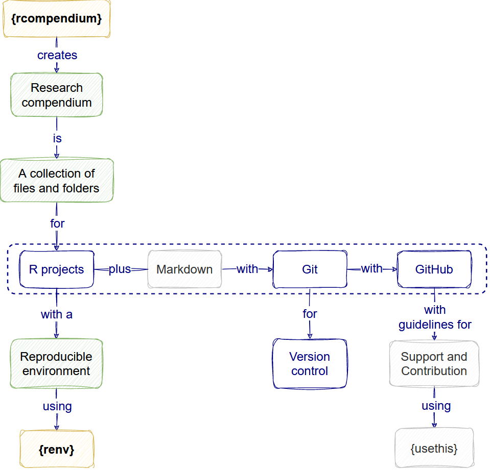

:::::::::::::::::::::::::::::::::::::: questions 

- How do I make my research project reproducible?
- How do I include packages as dependencies of my project?
- What features are related to reproducible research?

::::::::::::::::::::::::::::::::::::::::::::::::

::::::::::::::::::::::::::::::::::::: objectives

- Add dependencies of a project using the `DESCRIPTION` file.
- Create an isolated and specific reproducible environment with `{renv}`
- Identify your project features related to reproducible software.

::::::::::::::::::::::::::::::::::::::::::::::::

## How do I make my analysis reproducible?

### The reproducible environment

Any analysis with R needs packages. These packages on which your project relies are called [dependencies](https://r-pkgs.org/dependencies-mindset-background.html). To make an analysis reproducible, we need to register these packages (and their versions) somewhere as your project's dependencies. That place is the `DESCRIPTION` file. 

In the [`DESCRIPTION` file](https://r-pkgs.org/description.html#the-description-file), dependencies are registered at the end of the file with the package names only and usually with a minimum version (`dplyr (>= 1.0.0)`). We can add dependencies using functions (`rcompendium::add_dependencies()`), and also use this file to automate version recovery (`devtools::install_deps()`). However, `DESCRIPTION` files are most useful for R packages.

For [non-package projects](https://r-pkgs.org/description.html#footnotes) we can use `{renv}`. It registers specific dependencies by implementing project-specific environments, which means that `{renv}` registers even the [SHA/hash](https://happygitwithr.com/repeated-amend.html?q=sha#um-what-if-i-did-push) from GitHub packages, feature that the `DESCRIPTION` file can not do. Also, `{renv}` isolates your project packages from your computer packages. Lastly, `{renv}` can detect new dependencies automatically, apart from adding them with functions (`renv::snapshot()`), and it can also automate the recovery of the whole project (`renv::restore()`).

:::callout

The `{renv}` package:

- _Isolates_ the dependencies of your project from your computer.
- Registers the _specific_ version of packages from CRAN or GitHub.
- Provides an _automated_ package management solution to restore an external project.

:::

### The analysis workflow 

Complementary to the dependencies, your analysis workflow must follow some good practices in scientific computing. 

First, for __Data management__, we need to save input data as originally created and, preferably, configure it as a read-only file. In your project, you can differentiate `raw-data` from `derived-data`

Second, for __Project organization__, we need to store analysis and generated files in specific and isolated folders. In your project, you can differentiate `analyses` files (like `.R` scripts and `.Rmd` files) from `figures` and other `outputs`. 


### Automate your analysis

The `make.R` file helps automate your analysis project. This file includes a script line to automatically restore your dependencies (`renv::restore()`) and run all the analysis scripts in your preferred order. The `make.R` file is the only `.R` file stored in the project's root given by the `{rcompendium}` template. You can use the `make.R` file as the only script to run and regenerate all your project outputs.

:::callout

The `make.R` file is inspired but not equivalent to GNU `Make` file. 

[GNU `Make`](https://www.gnu.org/software/make/) files can identify out-of-date files and re-execute any downstream code that needs to be updated, usually used for [`bash` scripts](http://book.biologistsguide2computing.com/en/stable/automation-is-your-friend.html).

To use this functionality for your `R` project, you can use the [`{targets}` package](https://books.ropensci.org/targets/).

:::


## Let's code

We need to play under the rules of the `{rcompendium}` template.
 
### The reproducible environment

We will use `{renv}` instead of `DESCRIPTION` files for this.

Usually, to [initiate](https://rstudio.github.io/renv/) a reproducible environment with `{renv}`, we need to run `renv::init()`. 


However, when working in a `{rcompendium}` template, your first step must be to run:

```r
rcompendium::add_renv()
```

```output
This project contains a DESCRIPTION file.
Which files should renv use for dependency discovery in this project? 

1: Use only the DESCRIPTION file. (explicit mode)
2: Use all files in this project. (implicit mode)
```

Write `2` and press ENTER to use `{renv}` instead of `DESCRIPTION` file.

:::challenge

### Question

Why not to use `{renv}` in addition to `DESCRIPTION`?

:::solution

We can use `{renv}` in addition to `DESCRIPTION`.

However, we opt to use `{renv}` instead of `DESCRIPTION` because the `rcompendium::add_dependencies(".")` function because it assumes that all packages to add to `DESCRIPTION` are from CRAN. If you want to add GitHub packages, [you need to add them manually](https://remotes.r-lib.org/articles/dependencies.html) in a different section called `Remotes:` and write `repository/package`. The `{renv}` package solves this automatically.


However, this still needs to be assessed with different scenarios to confirm this as the final best decision.

If you decide to use `{renv}` in addition to `DESCRIPTION` run:

```r
rcompendium::add_dependencies(".")
```

Note that this function requires one argument specification `"."`, which means that your [working directory](https://www.epirhandbook.com/en/r-basics.html?q=getwd#working-directory) must be at the root of the R project.

The output below details which packages were included in the description file

```
✔ Scanning 'Imports' dependencies
  (*) Found 2 package(s)
  (*) Adding the following line in 'DESCRIPTION': `Imports: devtools, here`
```

:::

:::


If you get an error message like:

```error
Error in renv_snapshot_validate_report(valid, prompt, force) : 
  aborting snapshot due to pre-flight validation failure
```

Run again the `rcompendium::add_renv()` function. You may get the following message:

```output
This project already has a private library. What would you like to do? 

1: Activate the project and use the existing library.
2: Re-initialize the project with a new library.
3: Abort project initialization.
```

Write option `1` and press ENTER.

This step creates a `renv/` folder and modifies the content of the `make.R` in `line 15`, replacing the default `devtools::install_deps()` by `renv::restore`.

Second, to get the status of the project run:

```r
renv::status()
```

```output
This project does not contain a lockfile.
Use renv::snapshot() to create a lockfile.
```

:::callout

Always follow the suggestions of the `renv::status()` output. You can also get a message from it each time you reopen your project.

:::

Third, to create the `lockfile` run:

```r
renv::snapshot()
```

This step creates a `renv.lock` file detailing the following: 

- R version on top and 
- specific version details of all the packages in the project's dependency tree (including SHA/hash for GitHub packages).

```
{
  "R": {
    "Version": "4.2.2",
    "Repositories": [
      {
        "Name": "CRAN",
        "URL": "https://packagemanager.posit.co/cran/latest"
      }
    ]
  },
  "Packages": {
    "R6": {
      "Package": "R6",
      "Version": "2.5.1",
      "Source": "Repository",
      "Repository": "RSPM",
      "Requirements": [
        "R"
      ],
      "Hash": "470851b6d5d0ac559e9d01bb352b4021"
    },
    ...
```

Now, you have completed your reproducible environment configuration. 

### The analysis workflow

The workflow will follow these three paths:

- Read `raw-data/` to `clean.R` it and save it to `derived-data/`.
- Read `derived-data/` to make a `plot.R` and save it to `figures/`.
- Read `derived-data/` to make a `table.R` and save it to `outputs/`.

First, [download the sample data set](https://github.com/reconhub/learn/raw/master/static/data/linelist_20140701.xlsx).

Since this is raw data, save it in the `data/raw-data/` folder.

Second, create the analysis script to clean this raw data set. Name it `01-clean.R`. Save it in the `analyses/` folder. Copy and paste these lines of code:

```r
# Load packages
library(readxl)
library(tidyverse)

# Read raw data
dat <- readxl::read_xlsx("data/raw-data/linelist_20140701.xlsx")

# Clean raw data
dat_clean <- dat %>% 
  select(case_id,date_of_onset,date_of_outcome,outcome) %>% 
  mutate(across(.cols = c(date_of_onset,date_of_outcome),
                .fns = as.Date)) %>% 
  mutate(outcome = fct(outcome,level = c("Death","Recover"),na = "NA"))

# Write clean data
dat_clean %>% 
  write_rds("data/derived-data/linelist_clean.rds")
```

Notice that we are writing a new cleaned data set in a different path: `data/derived-data/`.

:::callout

- The default folder to save R scripts will be `R/`. This path is the place to write your _Modular functions_. Go to the `analyses/` folder to save your analysis script.

- Yes, it is named `analyses/` not "analysis".

:::

Rstudio will invite you to install new packages. Press Install. Always run `renv::status()` after installing new packages:

```r
renv::status()
```

```output
The following package(s) are in an inconsistent state:

 package       installed recorded used
 backports     y         n        y   
 bit           y         n        y   
```

In this case, we need to follow the instructions in the section of [Missing packages](https://rstudio.github.io/renv/reference/status.html#missing-packages) from the `?renv::status()` documentation.

```r
renv::install()
```

```output
- There are no packages to install.
- Automatic snapshot has updated '~/0projects/projectname/renv.lock'.
```

Third, create an analysis script to create an [incidence plot](https://www.reconverse.org/incidence2/) for this cleaned data set. Name it `02-plot.R`. Save it in the `analyses/` folder. Copy and paste these lines of code:

```r
# Load packages
library(tidyverse)
library(incidence2)

# Read data
ebola_dat <- read_rds("data/derived-data/linelist_clean.rds")

# Create incidence2 object
ebola_onset <- 
  incidence2::incidence(
    x = ebola_dat,
    date_index = c("date_of_onset"),
    interval = "epiweek"
  )
  
# Read incidence2 object
ebola_onset

# Plot incidence data
plot(ebola_onset)

# Write ggplot as figure
ggsave("figures/02-plot_incidence.png",height = 3,width = 5)
```

Notice that we are writing the new plot in a different path: `figures/`.

:::challenge

- Explore the `i2extras::fit_curve()` to [fit a model](https://www.reconverse.org/i2extras/articles/fitting_epicurves.html#modeling-incidence) to the incidence curve. 
- Save the output table in the corresponding folder.

:::hint

- You can reuse the `incidence2` object as input in the same file.
- Remember to update the `{renv}` status if you need to install and use a new package for this task

:::

:::

### Automate your analysis

The easiest step to forget!

Lastly, list all `.R` scripts and `.Rmd` in a sequential order in the `make.R` file after `line 32`:

```r
## Run Project ----

# List all R scripts in a sequential order and using the following form:
# source(here::here("analyses", "script_X.R"))

source(here::here("analyses", "01-clean.R"))
source(here::here("analyses", "02-plot.R"))
```

:::checklist



:::


## Reproducible research features

We defined Reproducible research as a practice that wants to ensure that _anyone with access_ to data inputs and software can _feasibly generate_ the outputs to check or build on them.

A key feature of this practice is the combination of __`{renv}`__ with the __`make.R` file__. With this file, and any other more sophisticated alternatives like `GNU Make` or `{targets}`, we are sure that we:

- Can feasibly _regenerate_ the outputs. 
- Can inform about the _reliability_ of the project.
- Have an _isolated_ time-proof capsule of dependencies.

::::::::::::::::::::::::::::::::::::: keypoints 

- A _dependency_ is a package that your project needs to run.

- Use the `DESCRIPTION` file to register your project dependencies.

- Use `{renv}` to isolate and create package-specific reproducible environments for your dependencies.

- Use the folder template to differentiate your `raw-data/` and `derived-data/`.

- Save analysis and generated files in isolated folders like `analyses/`, `figures/`, and `outputs/`.

- Use the `make.R` to list your analysis scripts and facilitate the regeneration of all your outputs.

- _Reproducible environments_ and _Make files_ are features related to Reproducible research. 

::::::::::::::::::::::::::::::::::::::::::::::::

