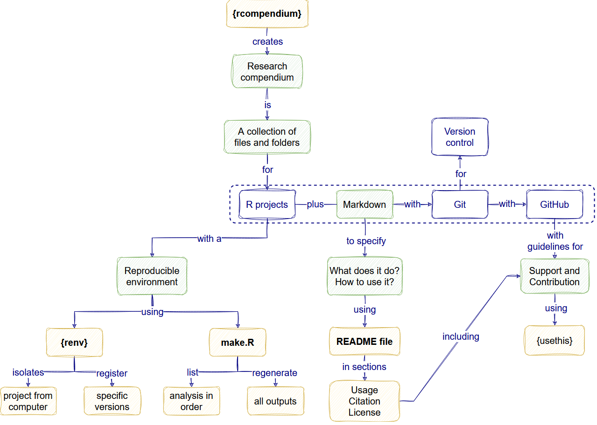

:::::::::::::::::::::::::::::::::::::: questions 

- Where is a full view of the concepts covered today?
- How can I self-assess my progress using these tools?
- Where can I ask for questions after this workshop?
- Where can I write my feedback on this workshop?

::::::::::::::::::::::::::::::::::::::::::::::::

::::::::::::::::::::::::::::::::::::: objectives

- Show the final concept map of the workshop.
- Share a self-assessment review checklist.
- Remind our communication forum.
- Share the feedback form of the workshop.

::::::::::::::::::::::::::::::::::::::::::::::::

## The goal

## Self-assessment template

During this process, we can self-assess our progress in these [good practices in scientific computing]([Wilson et al. 2017](https://journals.plos.org/ploscompbiol/article?id=10.1371/journal.pcbi.1005510)) using a __review checklists__ like the one used by [JOSS, the Journal of Open Source Software](https://joss.readthedocs.io/en/latest/review_checklist.html).

:::callout

We related these two references in one [Google sheet](https://docs.google.com/spreadsheets/d/1dsGg9RoD3yCEfgHAr0ARQ-nJ1RWSeCEXcycGk7dFRKs/edit?usp=sharing). Take a look!

:::

## Write an individual learning reflection

Before we wrap up, please take 5 minutes to think over everything we have covered so far. 

- On a piece of paper, write down something that captures what you want to remember about the day. 
- The Instructor will not look at this - it is just for you.
 
If you do not know where to start, consider the following list for a starting point:

- Draw a concept map, connecting the material
- Draw pictures or a comic depicting one of the day's concepts
- Write an outline of the topics we covered
- Write a paragraph or "journal" entry about your experience of the workshop today
- Write down one thing that struck you the most

This exercise should take about 5 minutes.

## Our communication channel

:::checklist

We remind you of our _communication forum_ called [GitHub Discussions](https://github.com/epiverse-trace/research-compendium/discussions). Here we will ask and solve our and your question on the topic!

You can fill your questions under the [Q&A category](https://github.com/epiverse-trace/research-compendium/discussions/categories/q-a)... at any time in the future!

:::

## Your constructive feedback

This form is anonymous: <https://forms.gle/4HHQatKdEmuzCiUH9>

If you did not fill out this form, please take 5 minutes to fill it. This form will be beneficial for further improvements to our workshop.

::::::::::::::::::::::::::::::::::::: keypoints 

- Use the JOSS review checklist to self-assess your progress.
- Use the `GitHub Discussions` as our communication forum after the workshop.
- Use the feedback form to share your constructive comments.

::::::::::::::::::::::::::::::::::::::::::::::::

