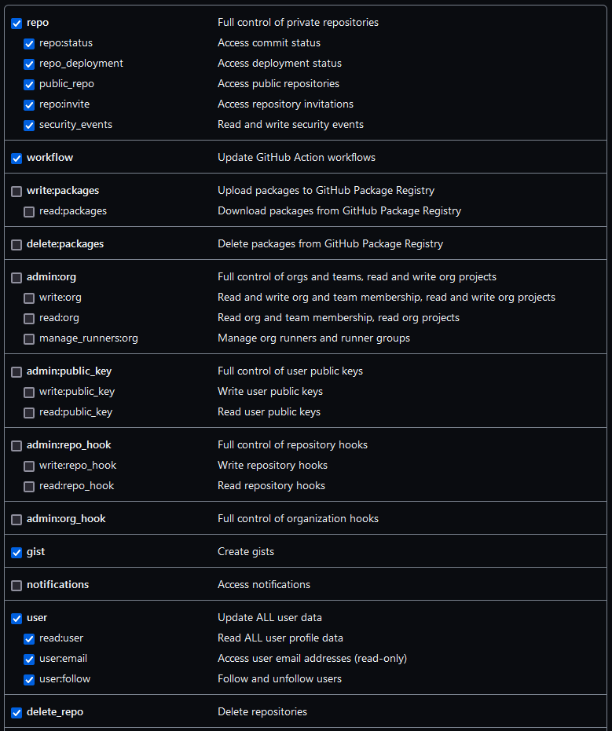

This lesson will be used for the workshop on "Improving the reliability, usability and sustainability of code for epidemic analysis with R packages" at [IDDconf 2023](https://iddconf.org/).

Follow these instructions to prepare for the event.

## Data Sets

<!--
FIXME: place any data you want learners to use in `episodes/data` and then use
       a relative link ( [data zip file](data/lesson-data.zip) ) to provide a
       link to it, replacing the example.com link.
-->

We will use data from a Ebola virus disease outbreak notified in a fictional country in West Africa:

- `linelist_20140701.xlsx`: a linelist containing case information up to the 1st July 2014.

[Download this data file file](https://github.com/reconhub/learn/raw/master/static/data/linelist_20140701.xlsx) and keep it in your Desktop.

## Software Setup

### Install Rstudio

Install R and Rstudio <https://posit.co/download/rstudio-desktop/>

### Create a GitHub account

Create a GitHub account <https://github.com/>

### Install Git

::::::::::::::::::::::::::::::::::::::: discussion

### Follow software specific suggestions

Follow [happygitwithr recommendation](https://happygitwithr.com/install-git.html) for each Operating system.


:::::::::::::::::::::::::::::::::::::::::::::::::::

:::::::::::::::: solution

### Windows

For [Windows](https://happygitwithr.com/install-git.html#install-git-windows)

:::::::::::::::::::::::::

:::::::::::::::: solution

### MacOS

For [MacOS](https://happygitwithr.com/install-git.html#macos)

:::::::::::::::::::::::::


:::::::::::::::: solution

### Linux

For [Linux](https://happygitwithr.com/install-git.html#linux)

:::::::::::::::::::::::::

### Install R packages

We strongly suggest to install the development version of the `rcompendium` package:

```r
## Install < remotes > package (if not already installed) ----
if (!requireNamespace("remotes", quietly = TRUE)) {
  install.packages("remotes")
}

## Install dev version of < rcompendium > from GitHub ----
remotes::install_github("FRBCesab/rcompendium")
```

Then, install all these packages:

```r
if(!require("pak")) install.packages("pak")

new <- c("gh",
         "usethis",
         "tidyverse",
         "here",
         "incidence2",
         "renv")

pak::pak(new)
```

### Configure Git and GitHub

::: prereq

### Follow all these steps

#### 1. Verify your git configuration

Use `gh::gh_whoami()` to check if your local git configuration recognize:

- your name
- you github account
- your _token_

```r
gh::gh_whoami()
```

```output
{
  "name": "Andree Valle Campos",
  "login": "avallecam",
  "html_url": "https://github.com/avallecam",
  "scopes": "gist, repo, workflow",
  "token": "gho_...AlAn"
}

```

If do not have a _token_, follow the next step.

#### 2. Get a situational report on your current Git/GitHub status:

Use `usethis::git_sitrep()` to check if there is no `✖ ...` line in the output with and error message. One example of this below:

```r
usethis::git_sitrep()
```

```error
✖ Token lacks recommended scopes:
  - 'user:email': needed to read user's email addresses
  Consider re-creating your PAT with the missing scopes.
  `create_github_token()` defaults to the recommended scopes.
✖ Can't retrieve registered email addresses from GitHub.
  Consider re-creating your PAT with the 'user' or at least 'user:email' scope.
```

Here I do had a _token_ but it was not configured correctly. If do not have a _token_ or get a similar error message, follow the next step. 

If you have another error message, copy and paste this output in your issue report to the email at the end of this page.  


#### 3. Create you GitHub token:

Do this with `usethis::create_github_token()`. This should redirect you to GitHub on your browser. Once there, check all the options in the figure below.

```r
usethis::create_github_token()
```

Check all of the following options:



#### 4. Configure your token

To [complete the configuration](https://happygitwithr.com/https-pat.html) of your token, use `gitcreds::gitcreds_set()`, then accept that you want to `2: Replace these credentials`. Do this by writing the number `2` and press ENTER.

```r
gitcreds::gitcreds_set()
```

```output
-> What would you like to do? 

1: Abort update with error, and keep the existing credentials
2: Replace these credentials
3: See the password / token

Selection: 2

```


#### 5. Run again the situational report:

Verify again that there is no `✖ ...` line in the output with and error message. A good output should like this:

```r
usethis::git_sitrep()
```

```output
Git config (global)
• Name: 'Andree Valle'
• Email: 'avallecam@gmail.com'
• Global (user-level) gitignore file: <unset>
• Vaccinated: FALSE
ℹ See `?git_vaccinate` to learn more
• Default Git protocol: 'https'
• Default initial branch name: 'master'
GitHub
• Default GitHub host: 'https://github.com'
• Personal access token for 'https://github.com': '<discovered>'
• GitHub user: 'avallecam'
• Token scopes: 'delete_repo, gist, repo, user, workflow'
• Email(s): 'avallecam@gmail.com (primary)', 'andree.valle-campos@lshtm.ac.uk'
Git repo for current project
ℹ No active usethis project
```

If you still have an error. Copy and paste this output in your issue report to the email at the end of this page. 

:::

### Configure your R environment

::: prereq

### Follow all these steps

#### 1. Set the default Git branch name

Run the code chunk below:

```r
usethis::git_default_branch_configure(name = "main")
```

This will homogenize the name of the default branch in our computers. We need this to make some auto generated links to work downstream.

#### 2. Add {rcompendium} credentials

Use `rcompendium::set_credentials()` add our name and personal information to the `.Rprofile` configuration file. 

Adapt the code chunk below to with your given name, family name, email, and ORCID. Adding your ORCID is optional.

```r
rcompendium::set_credentials(
  given = "Andree",
  family = "Valle-Campos",
  email = "avallecam@gmail.com",
  orcid = "0000-0002-7779-481X"
)
```

You can access to the content of the `.Rprofile` file with `usethis::edit_r_profile()`.

:::

## Your Questions

If you need any assistance installing the software, configuring Git and GitHub, or have any other questions about the workshop, please send an email to <andree.valle-campos@lshtm.ac.uk>

